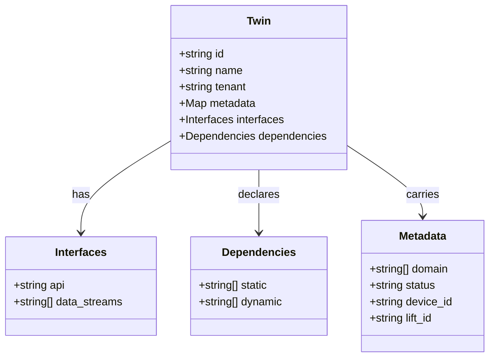
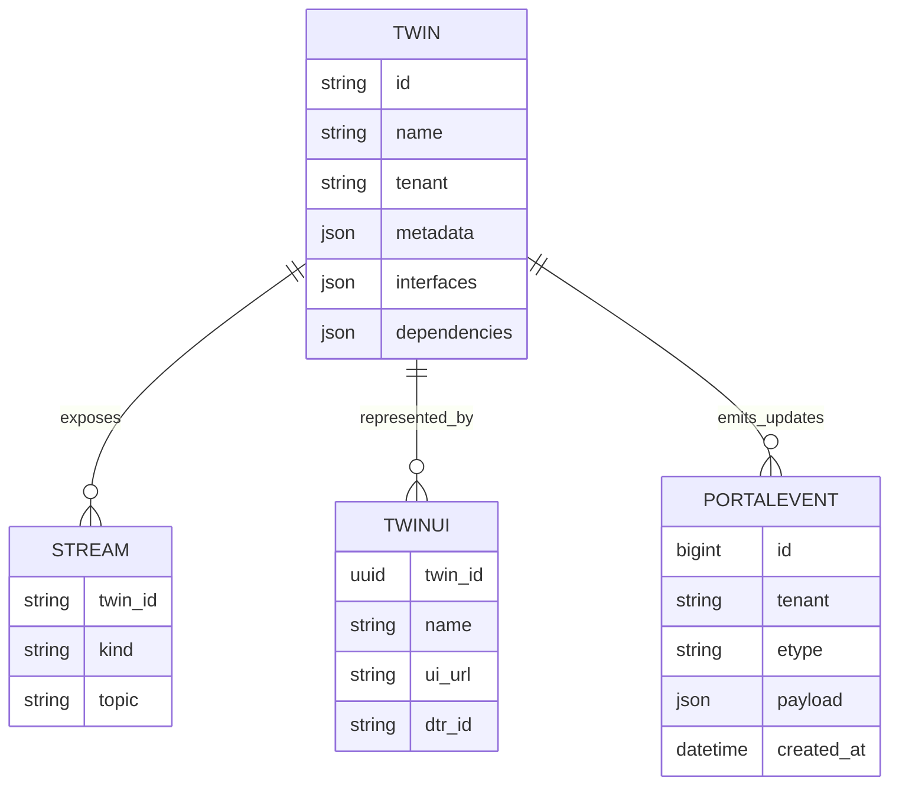
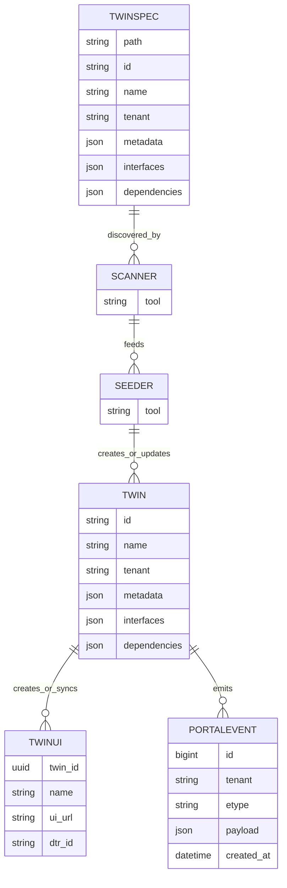
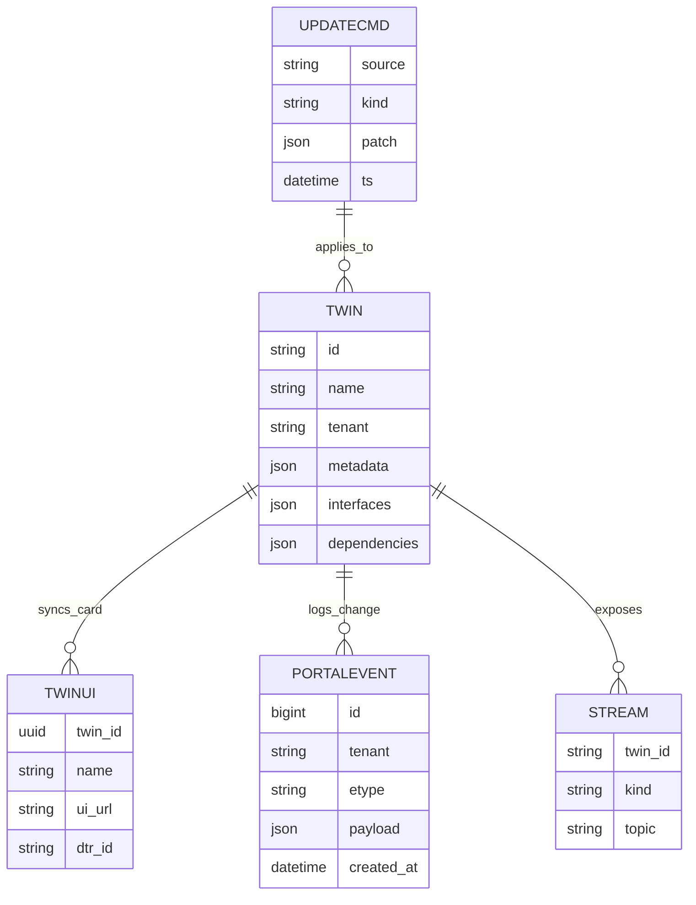
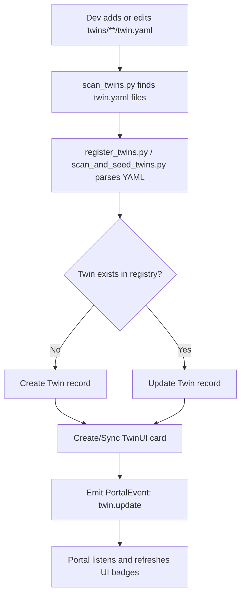
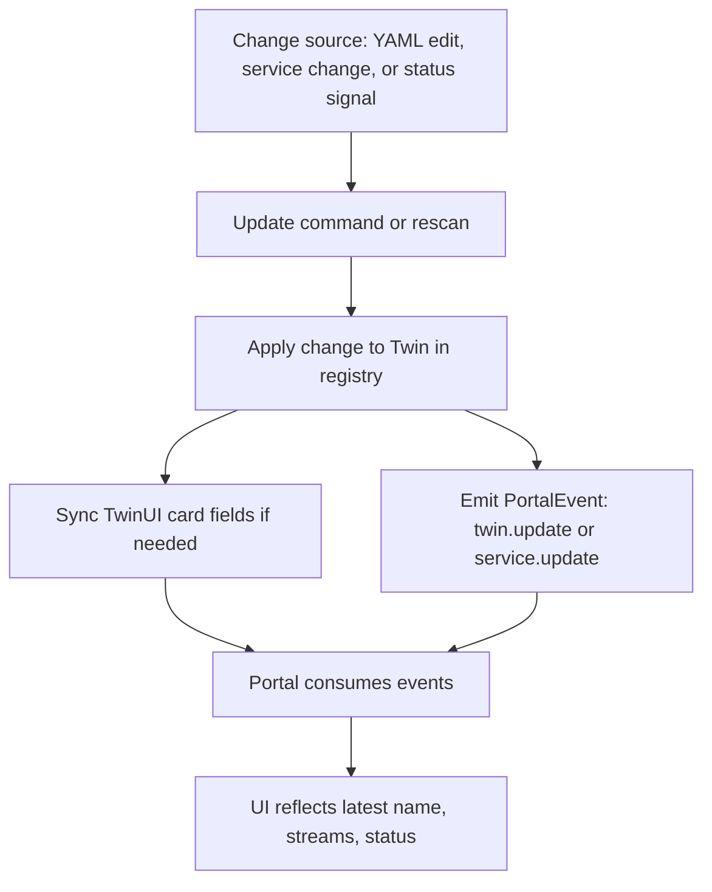
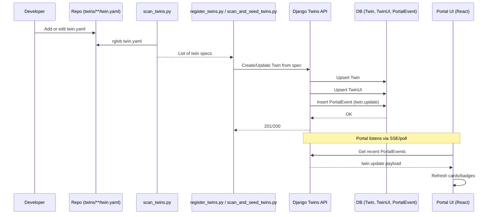
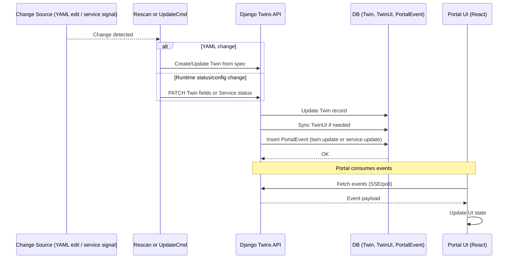

## Twin Ontology & Platform Features

This project implements a **polyglot Digital Twin Platform (DTP)** with the following principles:

- Twins are defined declaratively in `twins/**/twin.yaml`.
- Each twin specifies its identity, tenant, metadata, interfaces (API + streams), and dependencies.
- A central Django registry and portal auto-discover and register twins.
- Data flows through multiple back-ends: MQTT, TimescaleDB, InfluxDB, Neo4j, MinIO.
- Per-twin stacks (Lift, Energy/HVAC, M5Core2) provide local UI and simulation.

---

### 1. Twin Specification Ontology

### TWIN Registration

### Information update ERD (status/config changes flowing to portal)

### Twin registration flow

### Twin information update flow

### Twin registration — end-to-end

### Twin information update — rescan or runtime change

## Run locally

For Windows, use WSL &mdash; you should already have it if you've installed Docker Desktop.  If not, follow the [Docker instructions for using WSL](https://docs.docker.com/desktop/features/wsl/).

**Note**: in general you will end up with two WSL virtual machines, one for general use and one used by Docker Desktop.

1. `cp .env.example .env`
2. `make up` (starts containers + creates venv)
3. `make test` (writes to each store and prints a summary)
4. MinIO console: http://localhost:9101 (user/pass from .env)
5. Neo4j browser: http://localhost:7474 (user: neo4j, pass from .env)

## Tear down
`make down`

## Storage back end
- Local: MinIO at `minio:9000` inside the compose network; host access via http://localhost:9100 (console http://localhost:9101).
- CI: LocalStack S3 at http://localhost:4566.

The MinIO test auto-detects which backend to use via `MINIO_ENDPOINT`.

## Notes
- Timescale hypertable is created by `data-storage/sql/timescale.sql`.
- Influx is pre-seeded with org/bucket/token from `.env`.
- Tests run purely with Python clients; no external frameworks required.

### Registry-driven orchestration (overview)
- Registry APIs (DTR + Service Registry):
  - `POST /api/registry/twins` — attach/register a twin with `{"@id","tenant","metadata","interfaces","dependencies"}`
  - `PATCH /api/registry/twins/{id}` — update lifecycle/status or interfaces/dependencies
  - `DELETE /api/registry/twins/{id}?soft=true` — set status to `deprecated`; hard delete if `soft` omitted
  - `GET /api/registry/twins?tenant=...` — list twins (portal source of truth)
  - `POST /api/registry/services` — register a service with `{category,interfaces,health}`
- Portal updates (SSE):
  - `GET /api/portal/stream?tenant=...` — Server-Sent Events for `twin.update|twin.delete|service.update` powering live UI.
- Data mapping:
  - Observations → Timescale `observation` hypertable
  - Events → Postgres `event_log` with JSON body + severity (see `data-storage/sql/events.sql`)
  - Relationships → Neo4j (via future orchestrator writers)
  - Blobs → MinIO/S3 (manifest pattern)

Security note: SSE endpoint is open in this demo build for simplicity; secure with cookie auth or an SSE token in production.

### Twin stacks (examples)
#### Lift Twin
- The Lift twin now runs as a local docker-compose stack under `twins/lift/compose.yaml` with:
  - `influx_local`: private InfluxDB 2 (not exposed to host) for the lift’s data.
  - `generator`: the data generator (`twins/lift/generator.py`) writing to local Influx; emits alerts. When alerts trigger, it also writes alert points to central Influx if `INFLUX_*` env vars are provided.
  - `ui`: a minimal CherryPy UI showing Vibration RMS and Alerts from the local Influx (host port `3001`).
- Start the Lift stack:
  - `docker compose -f twins/lift/compose.yaml up -d`
- Configure central alert writes via env (in the Lift stack's `generator` service): `CENTRAL_INFLUX_URL`, `INFLUX_ORG`, `INFLUX_BUCKET`, `INFLUX_TOKEN`.

## Repository Layout
- `ui/` — portal and future web UIs
- `data-storage/` — database init/config (e.g., Timescale SQL)
- `infrastructure/` — infra components (e.g., MQTT broker config)
- `data-collection/` — simulators and ingestors (e.g., MQTT simulator)

## Kubernetes (optional)
- Prereq: enable Docker Desktop Kubernetes or use a `kind` cluster.
- Apply namespace and services:
  - `kubectl apply -f k8s/namespace.yaml`
  - `kubectl apply -f k8s/postgres-timescale -n dtp`
  - `kubectl apply -f k8s/neo4j -n dtp`
  - `kubectl apply -f k8s/influx -n dtp`
  - `kubectl apply -f k8s/minio -n dtp`
- Wait for pods: `kubectl get pods -n dtp`
- Run tests inside the cluster:
  - `kubectl apply -f k8s/test-job -n dtp`
  - `kubectl logs -n dtp job/dtp-test`
- Port-forward UIs (optional):
  - Neo4j: `kubectl port-forward -n dtp svc/neo4j 7474:7474 7687:7687`
  - InfluxDB: `kubectl port-forward -n dtp svc/influx 8086:8086`
  - MinIO: `kubectl port-forward -n dtp svc/minio 9000:9000 9001:9001`

## MQTT Simulator (optional)
- Services: an embedded Mosquitto broker (`mqtt`) and a `simulator` container are included in `docker compose`.
- Start: `docker compose up -d` (or start individually: `docker compose up -d mqtt simulator`)
- What it does:
  - Publishes JSON sensor messages to MQTT topic `dtp/sensors/room1/temp` every 5s.
  - Subscribes to `dtp/sensors/#` and, for each message, writes:
    - Time-series point to InfluxDB bucket `signals` (measurement `observation`).
    - Relational rows to TimescaleDB tables `signal` and `observation`.
- Configure via env (override in `.env` or compose):
  - `PUBLISH_INTERVAL_SEC` (default `5`)
  - `MQTT_TOPIC` (default `dtp/sensors/room1/temp`)
  - `SIM_SIGNAL_NAME` (default `temp_room_1`), `SIM_SIGNAL_UNIT` (default `C`)
- Observe logs: `docker compose logs -f simulator`
- Verify data:
  - TimescaleDB: `docker compose exec db psql -U dtp -d dtp -c "select count(*) from observation;"`
  - InfluxDB UI: http://localhost:8086 → Data Explorer → query measurement `observation` in bucket `signals`.
#### Energy & HVAC Twin
- Stack under `twins/energy_hvac/` with a generator mirroring to central Influx and a simple CherryPy UI (host port `3002`).
- Start the stack:
  - `docker compose -f twins/energy_hvac/compose.yaml up -d`
- Configure central writes via env in `generator` (picked from repo `.env` via `env_file`).

### Auto-discovery & registration
- Django startup scans `polyglot-dtp/twins/**/twin.yaml` and registers twins into the DTR, syncing portal cards when possible.
- Manual/continuous registration:
  - One-shot: `docker compose run --rm runner bash -lc "pip install -r requirements.txt && python register_twins.py"`
  - Watch mode: `docker compose run --rm runner bash -lc "pip install -r requirements.txt && python register_twins.py --watch"`

### Portal notes
- React portal at http://localhost:8083 uses same-origin API (`/api/*`) via the Nginx proxy inside the container.
- Health badges under the title show Backend, Health, DB, Influx, Cron, and Updated timestamp.
- Admin (staff-only): Users, Twin Cards, Grants (with revoke).
